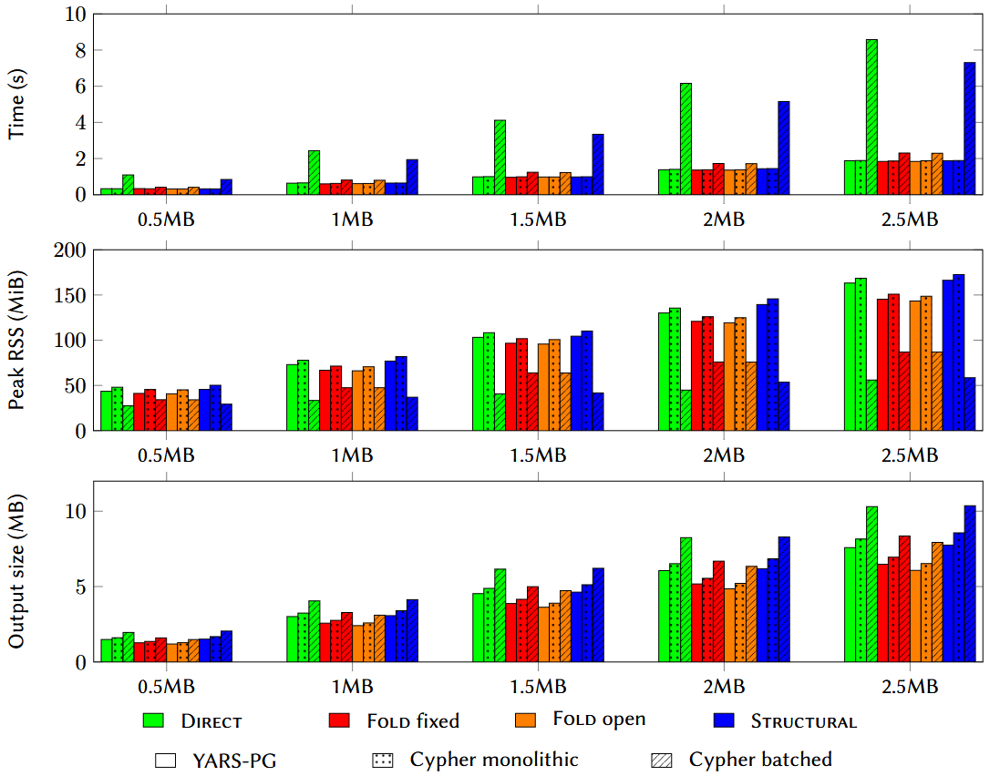
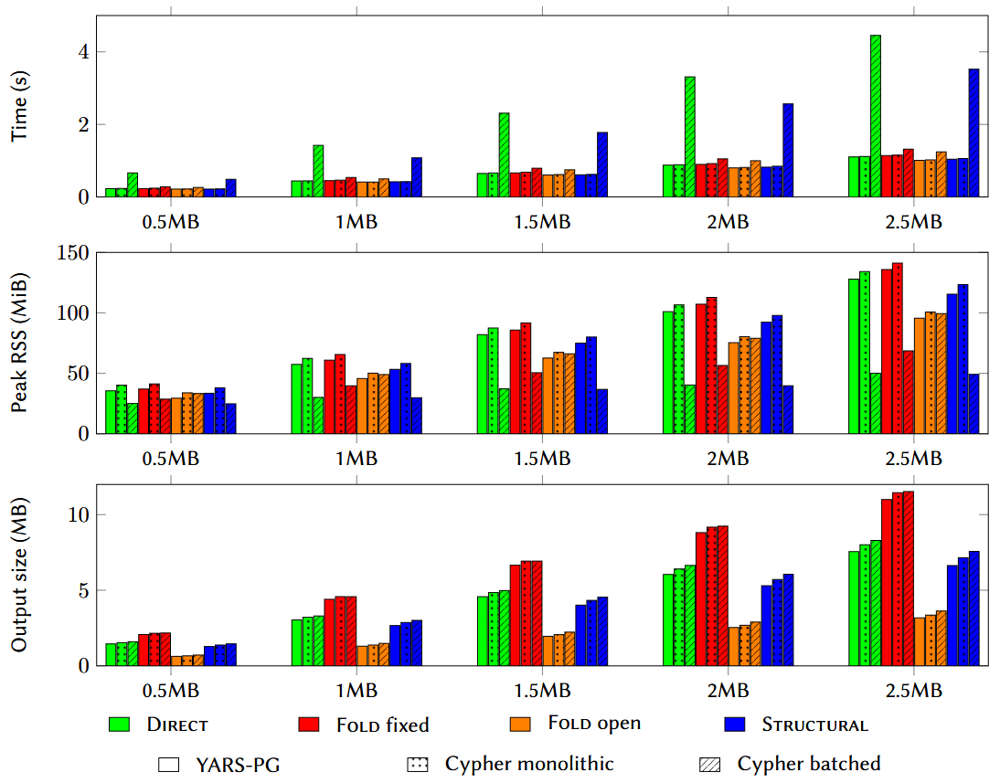

We evaluate the prototype implementations of all variants in terms of conversion time, peak resident set size (RSS), output size, and, for the synthetic workload, Neo4j loading time. The implementations produce either the textual YARS-PG format or a Cypher loading script. For *FOLD*, fixed and open folding are measured separately.

## Experimental setup

The experiments ran on a single-socket workstation with an Intel Core Ultra 7 265 processor, comprising eight performance cores and twelve efficient cores (20 cores and 20 hardware threads in total), and 30 GiB of RAM. The workstation ran a 64-bit Linux system with kernel 6.17.0-1028-oem. We did not pin processes to cores, so the measurements include operating-system scheduling effects. Swap was available but remained unused during the measurement campaign.

The software stack consisted of Python 3.12.3, OpenJDK 21.0.11, and Neo4j Community 2026.06.0. Each conversion was executed as a fresh process and measured with GNU `time`; the elapsed time therefore covers parsing, translation, serialization, and writing the output file. GNU `time`'s maximum-RSS value, reported in KiB on this platform, was converted to MiB. Neo4j loading time was measured by timing `cypher-shell`; it excludes Cypher generation and database clearing and does not measure the resident memory of the Neo4j server.

For each workload, the 60 conversion configurations were run 10 times, giving 600 runs, with a 3,600 s timeout per process. They comprise five input sizes, three translations, and three output configurations, with fixed and open folding measured separately for *FOLD*. The output configurations were YARS-PG, monolithic Cypher, and batched Cypher. The latter, called *`large-file`* in the CSV results produced by our implementation, used batches of 1,000 rows. It also adds the loader-specific label *`RDF12Node`* and property *`rdf12_id`*; these are used for indexed endpoint lookup and are not part of the conceptual translations.

Neo4j loading was evaluated only for the synthetic workload. Each batched configuration was loaded five times. The monolithic mode was loaded once, for *DIRECT* and the smallest input, to provide a single baseline. Neo4j authentication was disabled, its heap was fixed at 8 GiB, and all other memory settings retained their defaults. The server remained running between loads.

Before each load we removed all nodes and relationships with *`MATCH (n) DETACH DELETE n`*; this operation retained the schema and page cache. In particular, the uniqueness constraint created by the first batched script remained in place for subsequent runs. Load order was fixed and caches were not flushed.

Figures report arithmetic means. The minimum, maximum, sample standard deviation, output size, peak RSS, and individual measurements are available in this repository. File sizes use decimal MB (1 MB=1,000,000 bytes), whereas memory consumption is reported in MiB.

The benchmark implementations retain blank nodes as distinct `BNode`-labeled nodes instead of applying the preliminary Skolemization assumed by the translation model; the measurements therefore characterize the implementations as released.

## Synthetic datasets

This repository contains an ad-hoc RDF genrator (see [synthetic_generator](https://github.com/RDF-PG-Interoperability/rdf12-to-pg/tree/main/synthetic-generator)). The generator's *`all`* profile combines 15 feature families: ordinary RDF triples, predicate--object lists, typed and directional literals, blank nodes, collections, explicit *`rdf:reifies`* triples, asserted and reified propositions, standalone and nested triple terms, multiple reifiers, a reifier of multiple propositions, annotation blocks, IRI references, and mixed RDF 1.2 syntax. This is a stress workload rather than a common-domain correctness test. In particular, standalone and nested triple terms fall outside the input restrictions of *DIRECT* and *FOLD* variants, and their implementations omit graph triples whose objects are such terms unless the predicate is `rdf:reifies`. Successful execution on this profile therefore demonstrates operational robustness, not information preservation outside the translations' stated domains.

### Datasets

Five datasets were generated with scale factors 200, 400, 600, 800, and 1,000 and seed 7. Their target-size labels (0.5--2.5 MB) are approximate: the actual Turtle files range from 463,802 to 2,358,092 bytes. Each increment of the scale factor adds the same number of examples from every feature family, yielding 67 graph triples per unit and between 13,400 and 67,000 graph triples overall. Table following table gives the exact dataset statistics.

| Target size | Scale factor | Turtle bytes | Lines | Graph triples |
|---|---:|---:|---:|---:|
| 0.5 MB | 200 | 463,802 | 10,835 | 13,400 |
| 1 MB | 400 | 937,299 | 21,635 | 26,800 |
| 1.5 MB | 600 | 1,410,801 | 32,435 | 40,200 |
| 2 MB | 800 | 1,884,380 | 43,235 | 53,600 |
| 2.5 MB | 1,000 | 2,358,092 | 54,035 | 67,000 |

### Conversion results

All 600 conversion processes returned exit status zero; as noted above, this does not constitute semantic validation for inputs outside a translation's domain. Mean conversion time for YARS-PG and monolithic Cypher increased approximately linearly over the tested range, from 0.31--0.32 s at 0.5 MB to 1.87--1.93 s at 2.5 MB. Run-to-run variability was small relative to this increase, but it does not isolate the fixed cost of process startup.

On this workload, *FOLD* produced the smallest output in both formats. At 2.5 MB, open folding reduced its monolithic Cypher output from 6.96 to 6.54 MB and its YARS-PG output from 6.49 to 6.08 MB. Mean Cypher time was effectively unchanged (1.871 s fixed and 1.872 s open), while YARS-PG changed from 1.893 to 1.839 s. For comparison, *DIRECT* produced 8.16/7.59 MB and *STRUCTURAL* 8.57/7.76 MB in Cypher/YARS-PG. These differences reflect both description folding and unsupported triples omitted by *FOLD*; they must not be read as a comparison of semantically equivalent outputs.

The batched Cypher mode increased generation time and output size in exchange for smaller statements and indexed endpoint lookups during loading. At 2.5 MB, mean batched-generation times were 8.82 s for *DIRECT*, 2.343/2.313 s for fixed/open *FOLD*, and 7.48 s for *STRUCTURAL*, versus 1.87--1.93 s for monolithic Cypher. At the same input size, batched conversion used 54.8--85.7 MiB of peak RSS, compared with 147.4--168.6 MiB for monolithic conversion. The timing trends, RSS, and putput size of the experiments with thsi dataset are shonw in the folowing figure:

### Neo4j loading results

Monolithic Cypher represents the complete graph as one *`CREATE`* statement, which Neo4j parses, plans, and executes as a single transaction. The only monolithic loading observation, for *DIRECT* at 0.5 MB, was 368.21 s. This single measurement provides neither a scaling trend nor a comparison among translations.

The batched mode instead emits statements containing at most 1,000 rows. It creates a uniqueness constraint on *`rdf12_id`*, loads nodes with *`UNWIND`* and *`MERGE`*, and creates relationships in separate *`UNWIND`* statements whose endpoint lookups use the indexed identifier.

For *DIRECT* at 0.5 MB, its mean loading time was 7.50 s, about 49 times lower than the single monolithic observation. This ratio is descriptive: the batched value averages five runs, and loading times varied substantially.

The following table reports the batched results. At 2.5 MB, the means were 31.62 s for *DIRECT*, 19.96/14.37 s for fixed/open *FOLD*, and 27.47 s for *STRUCTURAL*. The fixed and open *FOLD* graphs both contained 43,078 nodes, but open folding reduced relationships from 50,000 to 48,000; *DIRECT* and *STRUCTURAL* contained 53,078/60,000 and 68,078/75,000 nodes/relationships. The standard deviations and overlapping ranges do not support a definitive runtime ranking, and the different graph sizes preclude a semantic ranking.

| Target size | *DIRECT* | *FOLD* fixed | *FOLD* open | *STRUCTURAL* |
|---|---:|---:|---:|---:|
| 0.5 MB |  7.50 +/- 5.10  |  5.27 +/- 3.37  |  5.70 +/- 4.32  |  6.57 +/- 4.78  |
| 1 MB |  8.15 +/- 8.53  |  9.43 +/- 4.71  |  5.41 +/- 5.79  |  11.22 +/- 6.70  |
| 1.5 MB |  17.61 +/- 5.26  |  16.87 +/- 2.92  |  8.76 +/- 7.06  |  18.30 +/- 4.35  |
| 2 MB |  25.34 +/- 5.60  |  21.20 +/- 5.39  |  9.22 +/- 7.09  |  24.35 +/- 3.36  |
| 2.5 MB |  31.62 +/- 5.22  |  19.96 +/- 2.51  |  14.37 +/- 7.31  |  27.47 +/- 2.93  |

These loading measurements compare the released implementations on one machine, not an absolute Neo4j throughput limit. The inputs are small, the run order was not randomized, and the retained schema and caches make the runs non-independent. The experiment nevertheless shows that batched Cypher substantially reduced loading time in the one configuration measured in both modes; a broader comparison would require monolithic baselines for the other translations and sizes under a fully reset database state.

## BKR/REF provenance workload

To complement the synthetic workload, we use samples of the RDF-star representation of the Biomedical Knowledge Repository (BKR) published with the REF benchmark and subsequently used by StarBench. We evaluate conversion only: the experiment neither executes the StarBench queries nor measures Neo4j loading or full-dump throughput.

### RDF 1.2 migration

The source uses the earlier RDF-star syntax, in which an embedded triple can occupy subject position. In RDF 1.2, a triple term is written as `<<(s p o)>>` and can occur only in object position. A source record of the form `<<s p o>> q v1, ..., vk` is therefore rewritten using a fresh, deterministically named blank-node reifier as `r rdf:reifies <<(s p o)>>` and `r q v1, ..., vk`.

Under this migration convention, the terms of the embedded triple, its non-asserted status, and its provenance values are retained. The graph structure and corresponding query patterns do change, however, and we do not claim or test general query equivalence.

### Datasets

For each target size, the sampler independently scans a source-ordered pool of metadata records. It admits only complete RDF-star records and skips a record if adding it would exceed the byte limit. This is necessary because a single BKR proposition can have thousands of PubMed provenance values on one source line. The resulting samples are deterministic but not nested prefixes of one another. Their composition therefore varies with size, as shown by the non-monotonic description-to-reifier ratio in the following table.

| Target size | Reifiers | Descriptions | Ann./reifier | Turtle bytes | Graph triples |
|---|---:|---:|---:|---:|---:|
| 0.5 MB | 154 | 8,835 | 57.4 | 499,932 | 8,989 |
| 1 MB | 134 | 18,554 | 138.5 | 999,917 | 18,688 |
| 1.5 MB | 159 | 28,042 | 176.4 | 1,499,694 | 28,201 |
| 2 MB | 211 | 37,402 | 177.3 | 1,999,851 | 37,613 |
| 2.5 MB | 286 | 46,639 | 163.1 | 2,499,756 | 46,925 |

### Conversion results

All 600 conversion runs returned exit status zero. Mean monolithic conversion time increased approximately with the number of graph triples over the tested range. At 2.5 MB, *STRUCTURAL* had the lowest observed means: 1.074 s for Cypher and 1.043 s for YARS-PG, compared with 1.124/1.120 s for *DIRECT*. For *FOLD*, fixed folding took 1.158/1.137 s and open folding 1.021/1.014 s in Cypher/YARS-PG. No statistical significance test was performed.

The output-size ordering differs from the synthetic workload. BKR records associate one quoted biomedical proposition with many *`derives_from`* values. Fixed folding in *FOLD* creates one triple term edge per description, so high description cardinality expands this representation. Open folding instead stores the descriptions in one edge record. At 2.5 MB this reduced *FOLD*'s monolithic output from 11.46 to 3.35 MB for Cypher and from 11.00 to 3.17 MB for YARS-PG. For comparison, *DIRECT* produced 8.01/7.55 MB and *STRUCTURAL* 7.15/6.63 MB in Cypher/YARS-PG. Thus, serialized size depends on description cardinality, folding form, and retained information.

At 2.5 MB, batched Cypher generation took 4.437 s for *DIRECT*, 1.317/1.240 s for fixed/open *FOLD*, and 3.510 s for *STRUCTURAL*. The low observed time for *FOLD* is consistent with its implementation avoiding the disk-backed indexes used by the other two translations. Batched conversion used approximately 50 MiB of peak RSS for *DIRECT* and *STRUCTURAL*, down from 134 MiB and 124 MiB in monolithic mode; *FOLD* used approximately 68/99 MiB in fixed/open batched mode and 142/101 MiB in fixed/open monolithic mode. These are observations over the tested range, not asymptotic memory bounds. The timing, RSS, and output size trends can be seen in the following figure:

Across both workloads, monolithic conversion time grew approximately with the number of parsed graph triples over the limited range tested. Batched Cypher reduced converter RSS but increased generation time and file size; in the synthetic experiment it also substantially reduced the one directly comparable Neo4j loading time. Open folding was slightly smaller on the mixed synthetic input and substantially reduced the high-cardinality BKR provenance records relative to fixed folding. These findings concern the released implementations and workload shapes; because the translations preserve different information, they do not establish a semantic ranking.

## Takeaways

 The results suggest several practical conclusions. 
* All measurements grow approximately linearly, and monolithic conversion time is nearly identical across the algorithms (1.02--1.15\,s at 2.5\,MB):
* Structural is the safest general-purpose variant: it supports arbitrary RDF 1.2 constructs, preserves the full structure, and introduces no clear runtime penalty. 
* Direct offers a compromise by preserving reifier identity and producing a natural LPG structure, but it assumes the usual reification pattern. 
* Fold, especially open folding, is best suited to provenance-heavy data: it can substantially reduce graph and serialization size when reifiers have many descriptions, at the cost of removing reifiers as separate graph objects. 
* The choice of output format matters more than the choice of translation. Independently of the translation strategy, Cypher generation has an even stronger impact on practical loadability. Batching increases generation time and file size, but reduces converter memory usage and can dramatically improve import time.
* The folding strategy dominates output size on this description-heavy workload. Fixed folding writes one edge per description, so BKR's many descriptions per reifier inflate it into the largest output overall; open folding gathers all of a reifier's descriptions into a single edge record and yields by far the smallest---at 2.5\,MB, *FOLD*'s Cypher output shrinks from 11.46\,MB to 3.35\,MB, less than half the size of any other variant. Byte size tells a story complementary to the nodes-and-edges based size ordering, and the two can diverge. *STRUCTURAL* serializes smaller than *DIRECT* here because *DIRECT* marks every edge with an assertion flag (the *asserted* key), and on a workload with tens of thousands of edges this outweighs the few hundred extra nodes that *STRUCTURAL* creates. Sizes should also be compared with care across variants, since each preserves different information.

In total, the experiments demonstrate the feasibility of all three translations and support the trade-off analysis of the paper.
